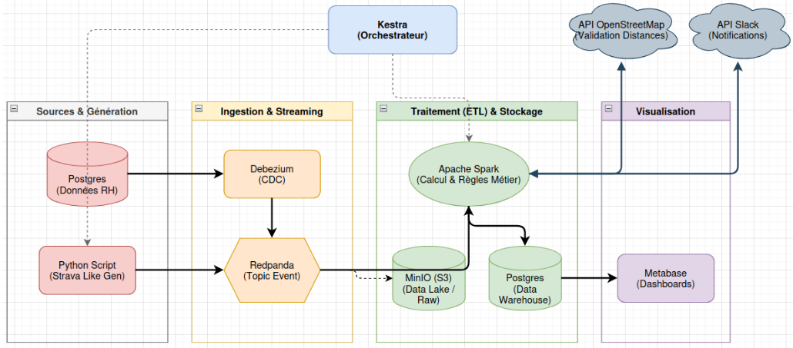

# POC : Incitations aux activités sportives - Sport Data Solution

> **Projet 12 - Option B** : Créer et automatiser une architecture de données distribuée.
> 
> Formation Data Engineer - **OpenClassrooms**

## Présentation

Ce POC (Proof of Concept) est un système d'incitations et de suivis des activités physiques des salariés, couplé à un mécanisme de **primes d'encouragement**. Le projet traite les flux en temps réel via une **architecture Medallion** (Bronze/Silver/Gold).

L'écosystème repose sur une stack moderne :

-   **Orchestration** : Kestra
    
-   **Ingestion & Streaming** : Debezium (CDC) & Redpanda (Kafka compatible)
    
-   **Traitement distribué** : Spark Structured Streaming
    
-   **Qualité & Stockage** : Soda, MinIO (S3) et PostgreSQL
    

## Objectifs

-   **CDC (Change Data Capture)** : Capture en temps réel des modifications de la base RH via Debezium.
    
-   **Traitement de Flux** : Transformation "on-the-fly" avec Spark Streaming vers le Data Lake (MinIO).
    
-   **Qualité des données** : Validation automatisée des contrats de données avec **SODA**.
    
-   **Monitoring** : Reporting quotidien et alertes Slack via Kestra.
    
-   **BI & Analytics** : Dashboarding dynamique et simulation de primes dans Metabase.
    

## Architecture

_Schéma représentant le flux de la génération de données jusqu'à la visualisation finale._



----------

## Structure du projet

Plaintext

```
/poc
├── docker-compose-storage.yml      # (Stack 1) MinIO + Postgres
├── docker-compose-streaming.yml    # (Stack 2) Redpanda + Console
├── docker-compose-ingestion.yml    # (Stack 3) Spark (dépend du streaming)
├── docker-compose-orchestrator.yml # (Stack 4) Kestra
├── docker-compose-cdc.yml          # (Stack 5) Debezium (Kafka Connect)
├── docker-compose-tools.yml        # (Stack 6) Monitoring & Metabase
├── docker-compose-generator.yml    # (Hors stack) Simulateur "Strava-like"
├── .env                            # Variables d'environnement globales
├── sql/
│   ├── schema_dwh.sql              # Schéma cible de la base de données
│   └── init_rh_db_clean.sql        # Script d'initialisation de la base  de données
├── spark/
│   └── jobs/
│       ├── stream_to_minio.py      # Job Streaming : Kafka -> MinIO (Raw)
│       └── batch_dwh_postgres.py   # Job Batch : MinIO -> Postgres (Gold)
├── orchestration/
│   ├── kestra/flows/               # Pipelines YAML (Step 1 à 3)
│   └── soda/                       # Configuration et checks Qualité (YAML)
└── schemas/
    └── sport_activity.avsc         # Contrat de données Avro

```

----------

## Installation & Initialisation

### 1. Démarrage des services

Lancez les stacks dans l'ordre suivant :

Bash

```
docker compose -f docker-compose-storage.yml up -d
docker compose -f docker-compose-streaming.yml up -d
# Attendre 30s que Redpanda soit prêt
docker compose -f docker-compose-orchestrator.yml up -d
docker compose -f docker-compose-tools.yml up -d

```

### 2. Initialisation de la base de données RH

Le système nécessite une base saine. Importez le fichier de référence (remplacez `votre_user` par votre nom d'utilisateur Linux) :

Bash

```
# 1. Vérifier la présence du fichier dans /sql
# 2. Injecter les données
docker exec -i postgres psql -U votre_user -d rh_db < sql/init_rh_db_clean.sql

# 3. Vérifier l'import
docker exec -it postgres psql -U votre_user -d rh_db -c "SELECT count(*) FROM ref_salaries;"

```

### 3. Construction des Images Docker (Build)

Avant de lancer les flux, vous devez construire les images personnalisées pour le générateur et Spark (contenant les dépendances spécifiques comme les connecteurs S3 et Avro).

Bash

```
# Construction de l'image du générateur "Strava-like"
docker build -t poc-generator-live ./generator

# Construction de l'image Spark Streaming
docker build -t poc-spark-streaming ./spark
```

### 4. Lancer le stack cdc pour lancer Debezium

Bash

```
docker compose -f docker-compose-cdc.yml up -d
```

### 5. Lancer dans Kestra les flows dans cet ordre

a) lancer Step1a (Enregistre le connecteur Debezium pour Postgres)

b) lancer Step1 (Flux du générateur vers Redpanda puis MinIO)

attendre 3 minutes

C) lancer Step2 (Flux live de MinIO vers DWH)

attendre 2 minutes

d) lancer Step3 (SODA)

e) lancer Monitoring quotidien


----------

## Pipeline de données (Architecture Medallion)

1.  **Ingestion (Bronze Layer - Raw)** :
    
    -   Capture des modifications Postgres par **Debezium**.
        
    -   Publication dans **Redpanda** (Topic Event).
        
    -   Spark Streaming écrit les données brutes dans **MinIO** au format Parquet.
        
2.  **Traitement (Silver Layer - Clean)** :
    
    -   Spark nettoie les données, valide les distances via l'API OpenStreetMap et applique les règles métier.
        
    -   Vérification de la qualité des données avec **SODA**.
                
    -   Monitoring quotidien avec **KESTRA**.

3.  **Visualisation (Gold Layer - Business)** :
    
    -   Chargement des agrégats dans le **Data Warehouse Postgres**.
        
    -   Notification **Slack** en cas d'anomalie ou de succès de batch.
        
    -   Consommation par **Metabase** pour le suivi des primes.
        

----------

## Technologies utilisées

| Couche        | Technologie         | Rôle                                                                 |
|---------------|--------------------|----------------------------------------------------------------------|
| Orchestrateur | Kestra             | Pilotage des flux, gestion des erreurs et rapports quotidiens.       |
| Streaming     | Redpanda           | Broker de messages haute performance (Kafka compatible).             |
| CDC           | Debezium           | Capture des changements d'état de la base de données.                |
| Traitement    | Apache Spark       | Calcul distribué pour le streaming et les agrégations batch.         |
| Stockage      | MinIO / Postgres   | Data Lake S3 (fichiers) et Data Warehouse (relationnel).             |
| Qualité       | Soda               | Tests automatisés sur les données (Data Contract).                   |
| BI            | Metabase           | Dashboards et KPIs pour les RH.                                      |

----------

## Visualisation Metabase

Le dashboard se connecte au Data Warehouse pour afficher :

-   **Suivi des primes** par année civile et par département.
    
-   **Topologie des activités** sportives (Running vs Cyclisme).
    
-   **Simulation des coûts** pour l'entreprise en fonction du taux de participation.
    

----------

## Configuration (.env)

Assurez-vous de configurer votre fichier `.env` à la racine avec vos accès API (Slack, OpenStreetMap) et vos identifiants de base de données avant de lancer les stacks.
